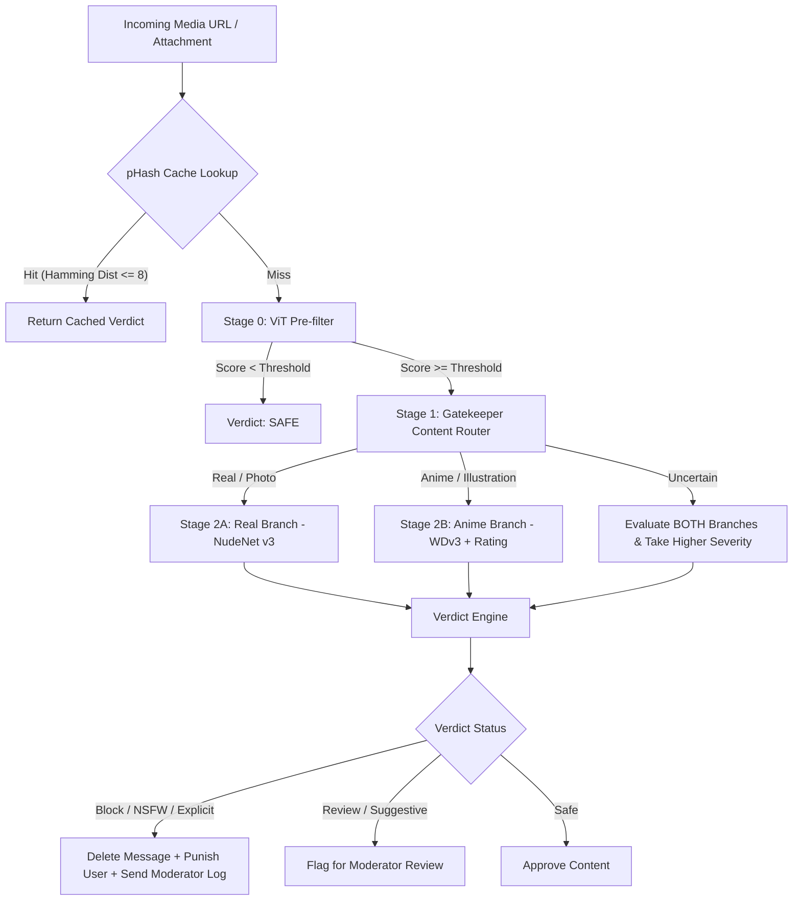

# 🤖 Local NSFW Auto-Moderation Discord Bot

An advanced, high-performance, and fully local AI-powered NSFW auto-moderation Discord bot. It operates entirely on-premise using ONNX Runtime (CPU) and NudeNet, requiring no external APIs, subscriptions, or cloud services to scan and moderate media.

---

## 🌟 Core Features

- **Multi-Format Moderation**: Scans both static images and video files. For videos, frames are dynamically extracted at target intervals using OpenCV and FFmpeg.
- **Council-Style Multi-Stage Detection Pipeline**:
  - **Stage 0: Pre-filter (ViT)**: Runs `AdamCodd/vit-base-nsfw-detector` to bypass deeper analysis for obviously safe content, minimizing CPU/GPU load.
  - **Stage 1: Content Type Router (Gatekeeper)**: Employs `deepghs/anime_real_cls` to determine if media is a real photograph or an anime illustration.
  - **Stage 2A: Real-Photo Branch (NudeNet v3)**: Detects exposure of human breasts, genitalia, and anus. Includes image quality enhancement (CLAHE contrast normalization, denoising, and adaptive upscaling) for low-resolution media.
  - **Stage 2B: Anime-Illustration Branch (WDv3 + Rating Classifier)**: Combines tag predictions from `SmilingWolf/wd-vit-large-tagger-v3` with ratings from `deepghs/anime_rating` using a customized score fusion algorithm.
- **Perceptual Hashing (pHash) Cache**: Computes a 64-bit perceptual hash fingerprint for each frame. Visually identical or near-duplicate media (Hamming distance $\le$ 8) triggers instant cache hits, bypassing AI inference entirely.
- **Interactive Active Learning & Feedback**: Log embeds sent to the moderator channel feature buttons (`✅ Correct Detection`, `❌ False Positive`, `⚠️ False Negative`) that capture moderator overrides. This feedback calibrates thresholds and tracks accuracy.
- **Automated SQLite Database Maintenance**: Cleans up old database rows (scan logs, caches, and feedback history) every 24 hours to prevent disk bloating.
- **Flexible Punishment Engine**: Configurable per-guild punishments including `timeout`, `kick`, `ban`, or simple channel warning/deletion.

---

## 🛠️ Detection Pipeline Architecture

The decision-making flow proceeds as follows for every scanned image/frame:



---

## 📊 Database Schema

The bot uses an SQLite database (`bot.db`) containing three primary tables:

### 1. `image_hash_cache`
Stores perceptual hash fingerprints of scanned frames to bypass redundant inference.
- `phash` (TEXT, Primary Key): 64-bit Hex string.
- `verdict`, `reason`, `branch`, `model` (TEXT).
- `hit_count` (INTEGER): Number of times this cache entry was hit.
- `created_at`, `last_seen_at` (TIMESTAMP).

### 2. `moderation_feedback`
Stores moderator-submitted feedback overrides for active learning.
- `message_id` (TEXT, Unique Index), `guild_id`, `channel_id`, `user_id`, `moderator_id`.
- `predicted_verdict`, `moderator_verdict` (TEXT).
- `model_scores`, `detected_tags` (TEXT as JSON).
- `branch`, `model` (TEXT), `processing_time_ms` (REAL).

### 3. `scan_log`
An audit trail used to compute bot performance and scan volume stats.
- `message_id`, `guild_id`, `channel_id`, `user_id`, `filename`, `verdict`, `branch`, `model`, `reason`.
- `processing_time_ms` (REAL), `cache_hit` (INTEGER).

---

## 📡 Slash Commands

Administrators with **Manage Messages** permissions can use the `/nsfw` slash command group:

| Command | Description |
| :--- | :--- |
| `/nsfw enable #channel` | Adds a specific channel to the NSFW monitoring list. |
| `/nsfw disable #channel` | Removes a channel from the monitoring list. |
| `/nsfw status` | Displays live bot settings, loaded AI models, CPU/VRAM usage, and cache configuration. |
| `/nsfw test <file>` | Runs the complete model council on an attachment and returns a verbose verification trace (no actions taken). |
| `/nsfw stats` | Shows overall scan volumes, cache hit rates, average processing times, and verdict breakdowns. |
| `/nsfw feedback-stats` | Details moderator feedback overrides, error rates, and most commonly misidentified tags. |
| `/nsfw export` | Exports the moderator feedback logs to a CSV file for system calibration. |

---

## ⚙️ Configuration

### `.env` File
Create a `.env` file in the project root:
```env
# Discord Settings
DISCORD_TOKEN=your_bot_token_here
PREFIX=;
GUILD_IDS=123456789012345678,876543210987654321

# Moderation Settings
MONITORED_CHANNELS=all  # Or comma-separated channel IDs
LOG_CHANNEL_ID=112233445566778899
DEBUG_LOG_CHANNEL_ID=998877665544332211
ADMIN_ROLE_ID=223344556677889900

# Performance & Storage
DEVICE=cpu              # 'cpu' or 'cuda'
MODEL_CACHE_DIR=./models
SQLITE_DB_PATH=./bot.db
MAX_VIDEO_SIZE_MB=50
MAX_VIDEO_DURATION_SECS=300
REVIEW_THRESHOLD_OFFSET=0.15
```

### `sensitivity.json`
Fine-tune threshold limits, tag categories, and score-fusion weights:
- **`global_threshold`**: Overrides base model thresholds if $>0$.
- **`prefilter.threshold`**: Initial ViT check limit (default `0.15`).
- **`pipeline_fusion.weights`**: Relative weights for anime scoring (`wdv3_explicit`, `anime_rating_r18`, `genital_score`, `breast_score`).
- **`real_branch.labels`**: Custom detection thresholds for NudeNet v3 classes.
- **`anime_branch.genital_tags` / `breast_tags`**: Target tags and score thresholds for Danbooru tags.

---

## 🚀 Installation & Setup

1. **Prerequisites**: Python 3.11 is required.
2. **Install Dependencies**:
   Double-click or run the installer script:
   ```cmd
   install_all_dependencies.bat
   ```
   This creates a Python Virtual Environment (`venv`), upgrades pip, and installs the contents of `requirements.txt`.
3. **Pre-download AI Models** (Recommended):
   ```cmd
   venv\Scripts\python.exe scripts/download_models.py
   ```
4. **Launch the Bot**:
   Run:
   ```cmd
   start.bat
   ```
   This automatically loads your environment configurations and boots the bot.
